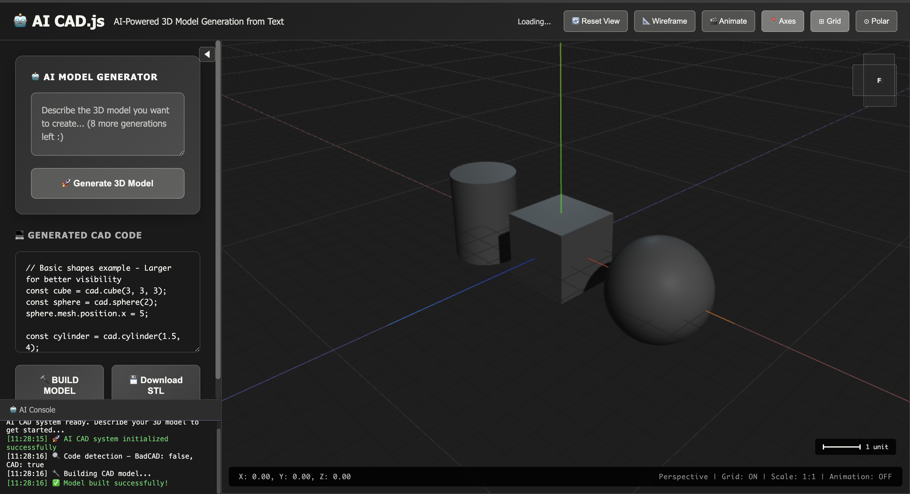

# Text-to-CAD: AI-Powered 3D CAD Application

[](https://opensource.org/licenses/MIT)
[](https://www.docker.com/)
[](https://threejs.org/)
[](https://fastapi.tiangolo.com/)
[](https://github.com/wrongbad/badcad)



A modular AI-powered 3D CAD application that generates 3D models from natural language descriptions with Google OAuth authentication and usage limits. Built with [BadCAD](https://github.com/wrongbad/badcad) for solid modeling and Three.js for interactive visualization.


*The AI CAD.js interface featuring the AI model generator, generated CAD code editor, and real-time 3D viewport with interactive controls.*

---

## 📋 Table of Contents

- [✨ Features](#-features)
- [🚀 Quick Start](#-quick-start)
- [🏗️ Project Structure](#️-project-structure)
- [🚀 Getting Started](#-getting-started)
- [🧩 Component Architecture](#-component-architecture)
- [🔧 Customization](#-customization)
- [🛠️ Development](#️-development)
- [📝 Usage Examples](#-usage-examples)
- [🧪 Testing the Workflow](#-testing-the-workflow)
- [🐳 Docker Deployment](#-docker-deployment)
- [🤝 Contributing](#-contributing)

## ✨ Features

### 🎯 Core Capabilities
- **🤖 AI-Powered Model Generation**: Transform natural language into BadCAD code for solid 3D modeling and STL export
- **📝 Live Code Editor**: View and edit generated BadCAD code with syntax highlighting and Three.js preview
- **🎨 Real-time 3D Visualization**: Interactive Three.js viewport with Blender-style navigation and professional controls
- **💾 STL Export**: Download BadCAD-generated models as production-ready STL files for 3D printing

### 🔧 Advanced Features  
- **🔐 Google OAuth Authentication**: Secure sign-in with usage tracking (10 models per user)
- **🎮 Dual Rendering System**: BadCAD for precise solid modeling, Three.js for interactive visualization and scene management
- **📐 Professional Viewport**: Wireframe toggle, animation, axes, grids, orthographic views, and measurement tools
- **🎨 Blender-style Interface**: Familiar CAD environment with intuitive camera controls and visual aids
- **📱 Responsive Design**: Works seamlessly across desktop and mobile devices

### 🚀 Developer Features
- **🧩 Modular Architecture**: Component-based frontend with clear separation of concerns
- **🐳 Docker Support**: One-command deployment with Docker Compose
- **⚡ Fast Development**: Hot reload backend with uvicorn and simple frontend serving

## 🚀 Quick Start

### Option 1: Docker (Recommended)
```bash
# Clone and start the application
git clone <repository-url>
cd text-to-cad
docker compose up --build

# Access the app
# Frontend: http://localhost:8080
# Backend API: http://localhost:8000
```

### Option 2: Manual Setup
```bash
# 1. Start Backend
cd backend
python3 -m venv .venv
source .venv/bin/activate
pip install -r requirements.txt
uvicorn app:app --host 0.0.0.0 --port 8000 --reload

# 2. Start Frontend (new terminal)
cd frontend
python -m http.server 8080
# Visit http://localhost:8080
```

> **💡 Tip**: For full AI functionality, you'll need to set up Google OAuth (see detailed setup below).

## 🏗️ Project Structure

```
text-to-cad/
├── README.md                 # Project documentation with setup instructions
├── docker-compose.yml        # Docker orchestration for full-stack deployment
├── .gitignore               # Git ignore rules for security and cleanliness
├── docs/                    # Documentation and assets
│   └── images/              # Screenshots and visual documentation
│       └── app_ui.png       # Application interface screenshot
├── backend/                 # Python FastAPI backend (BadCAD integration)
│   ├── app.py              # Main API server with model generation endpoints
│   ├── requirements.txt    # Python dependencies (FastAPI, BadCAD, etc.)
│   ├── Dockerfile          # Backend container configuration
│   └── README.md           # Backend-specific documentation
└── frontend/               # Frontend (HTML/JS/CSS)
    ├── index.html          # Main HTML entry point
    ├── Dockerfile          # Frontend container configuration (Nginx)
    ├── nginx.conf          # Nginx server configuration
    ├── package.json        # Frontend dependencies
    ├── components/         # Modular UI components
    │   ├── header.js       # Top navigation with auth controls
    │   ├── sidebar.js      # AI generator and code editor
    │   ├── viewport.js     # 3D model viewer (Three.js)
    │   └── console.js      # System logs and messages
    ├── scripts/            # Core application logic
    │   ├── app.js          # Main app coordinator
    │   ├── ai-generator.js # Text-to-3D model conversion
    │   ├── auth.js         # Google OAuth integration
    │   ├── cad-engine.js   # CAD code execution and model building
    │   ├── projects.js     # Template and project management
    │   └── three-setup.js  # Three.js scene configuration
    └── styles/             # CSS modules for each component
        ├── main.css        # Global styles and layout
        ├── header.css      # Navigation styling
        ├── sidebar.css     # Input panel styling
        ├── viewport.css    # 3D viewer styling
        └── console.css     # Console panel styling
```

## 🚀 Getting Started

### 1. Backend Setup

```bash
cd backend
python3 -m venv .venv
source .venv/bin/activate
pip install -r requirements.txt
uvicorn app:app --host 0.0.0.0 --port 8000 --reload
```
The backend will run on http://localhost:8000

### 2. Frontend Setup

Open the frontend in your browser or serve it with a local server:

```bash
# Option 1: Direct file
open frontend/index.html

# Option 2: Simple HTTP server
cd frontend
python -m http.server 8080
# Then visit http://localhost:8080
```

### 3. Google OAuth Setup (Required for AI Generation)

To enable user authentication and model generation limits:

1. Follow the detailed guide in [`docs/GOOGLE_OAUTH_SETUP.md`](./docs/GOOGLE_OAUTH_SETUP.md)
2. Create Google Cloud credentials
3. Update the Client ID in `frontend/scripts/auth.js`
4. Users can then sign in and generate up to 10 models

**Note**: Without Google OAuth setup, users can still:
- View and edit code examples
- Use the Three.js playground mode
- Build models from pre-written code

---

## 🧩 Component Architecture

### Backend (Python/FastAPI)
- **`app.py`**: Receives prompts, generates BadCAD code, executes [BadCAD](https://github.com/wrongbad/badcad) for actual 3D model generation and STL export
- **`requirements.txt`**: Python dependencies (FastAPI, BadCAD for solid modeling, etc.)

### Frontend (HTML/JS/Three.js)
- **`index.html`**: Main entry point, loads scripts and styles
- **`components/`**: UI modules (header, sidebar, viewport, console)
- **`scripts/`**: Core logic (AI prompt processing, Three.js viewport management, CAD code editing, templates)
- **`styles/`**: CSS modules for each component

### Key Technologies
- **[BadCAD](https://github.com/wrongbad/badcad)**: Python-based solid modeling engine for precise 3D geometry and STL generation
- **Three.js**: Interactive 3D visualization and scene management
- **FastAPI**: High-performance backend API framework
- **Google OAuth**: User authentication and usage tracking

---

## 🎯 Features

- **AI-Powered Model Generation**: Natural language prompts converted to BadCAD code for solid 3D modeling
- **Dual Rendering System**: BadCAD generates production-ready STL files; Three.js provides interactive viewport visualization
- **Manual CAD Code Editing**: Edit generated BadCAD code with live Three.js preview
- **Predefined Project Templates**: Ready-to-use examples for gears, mugs, bolts, and mechanical parts
- **Interactive 3D Viewport**: Professional Three.js-based scene with Blender-style navigation and controls
- **STL Export**: Download BadCAD-generated models as STL files for 3D printing
- **Responsive, Modular UI**: Component-based frontend architecture
- **Fallback Mode**: When backend is unavailable, Three.js provides local visualization and basic shape generation

---

## 🔧 Customization

### Add New Object Types (AI)
1. Update pattern recognition in `frontend/scripts/ai-generator.js`
2. Add generator method for new object
3. Register in templates

### Add New Project Templates
- Add to `frontend/scripts/projects.js`

### Styling
- Edit CSS in `frontend/styles/`

---

## 🛠️ Development

### File Loading Order
1. External dependencies (Three.js)
2. Core scripts (CAD engine, AI generator, Three.js setup, projects)
3. Component scripts (header, sidebar, viewport, console)
4. Main app coordinator (app.js)

### Add New Components
1. Create JS in `frontend/components/`
2. Add CSS in `frontend/styles/`
3. Include in `index.html`
4. Initialize in `app.js`

---

## 📝 Usage Examples

### AI Prompts
- "Create a coffee mug with a handle"
- "Design a gear with 12 teeth and a center hole"
- "Make a staircase height 200mm and width 150mm"
- "Build a simple table with 4 legs"

### Manual CAD Code
```javascript
// Create a simple box
const model = cad.cube(2, 2, 2);

// Create a cylinder
const model = cad.cylinder(1, 3);

// Combine objects
const base = cad.cube(3, 0.5, 3);
const pillar = cad.cylinder(0.5, 4);
pillar.mesh.position.y = 2;
const model = base.union(pillar);
```

---

## 🧪 Testing the Workflow

1. **Start the backend server** (see Backend Setup)
2. **Open the frontend** in your browser
3. **Enter a text prompt** in the AI prompt section (e.g., "create a cube with a hole")
4. **Click "Generate 3D Model"**

**Expected Flow:**
1. Frontend sends natural language prompt to backend API
2. Backend generates BadCAD code for solid modeling
3. Backend executes BadCAD to create precise STL file
4. Backend returns model ID and BadCAD code to frontend
5. Frontend displays BadCAD code in live code editor
6. Frontend downloads STL file and displays it using Three.js for interactive visualization

**Fallback Mode:** If backend is unavailable, frontend provides Three.js-based local shape generation and visualization.

---

## 🤝 Contributing

1. Fork the repository
2. Create a feature branch
3. Make your changes in the appropriate module
4. Test the functionality
5. Submit a pull request

## 📄 License

This project is open source and available under the MIT License.

## 🔗 References

- **[BadCAD](https://github.com/wrongbad/badcad)** - Python-based solid modeling engine used for 3D geometry generation
- **[Three.js](https://threejs.org/)** - JavaScript 3D library for interactive visualization
- **[FastAPI](https://fastapi.tiangolo.com/)** - Modern, fast web framework for building APIs with Python

---

## 🐳 Docker Deployment

### Prerequisites
- [Docker](https://docs.docker.com/get-docker/) and [Docker Compose](https://docs.docker.com/compose/install/) installed

### Quick Start

1. Build and start both backend and frontend:
   ```bash
   docker compose up --build
   ```

2. Access the app:
   - Frontend: http://localhost:8080
   - Backend API: http://localhost:8000

### Project Structure (Dockerized)
- `backend/Dockerfile` – Python FastAPI backend container
- `frontend/Dockerfile` – Nginx static server for frontend
- `docker-compose.yml` – Orchestrates both services